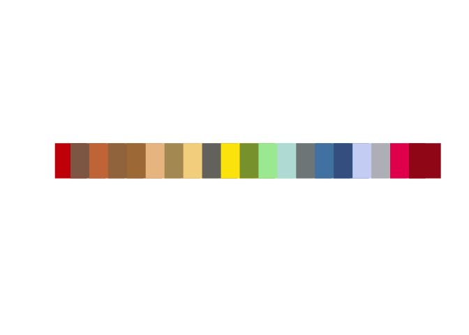
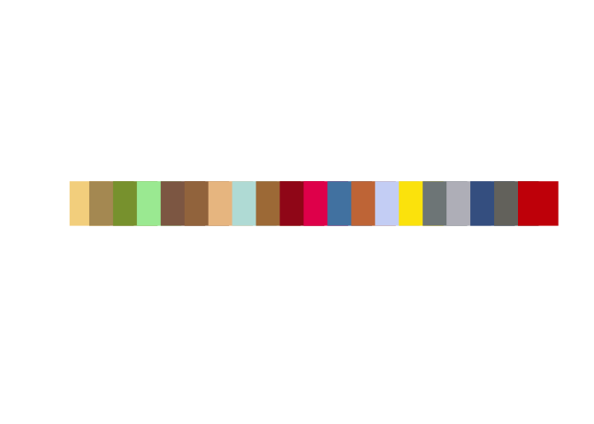
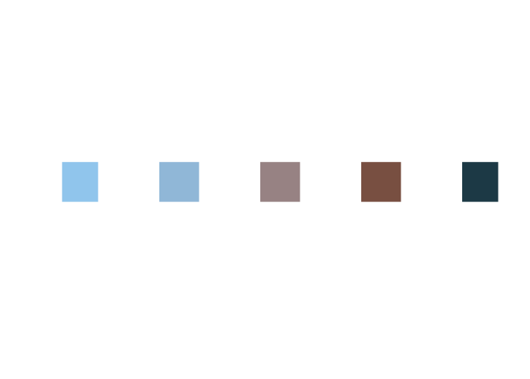
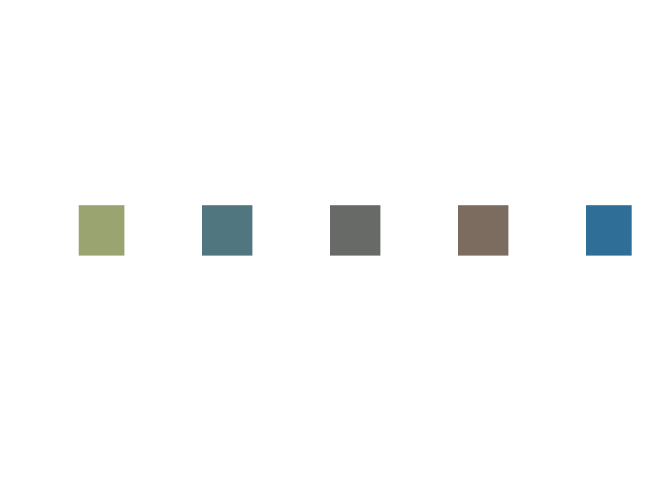
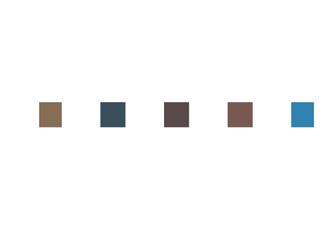

<!-- README.md is generated from README.Rmd. Please edit that file -->

# Rainbaud

### An `R` package for converting text into colors.

Color theory has been a largely explored field of research, in which the
relationship between color and other forms of perception stands as an
under-defined and still unsolved problem. Many have been addressing the
issue of associating colors to other domains of perception. For example
Kandinsky (1911) relates colors to moods, while Ramachandran and Hubard
investigate the connection between sounds and color in brain attivation
patterns (Chromesthesia).

We built on the framework introduced by the work of Rimbaud (1871), who
proposes to link colors to text, by associating each vowel to a
chromatic shade:

> **Vowels** - *Arthur Rimbaud* (1871)
> 
> A black, E white, I red, U green, O blue: vowels,  
> I shall tell, one day, of your mysterious origins:  
> A, black velvety jacket of brilliant flies  
> which buzz around cruel smells,
> 
> Gulfs of shadow; E, whiteness of vapours and of tents,  
> lances of proud glaciers, white kings, shivers of cow-parsley;  
> I, purples, spat blood, smile of beautiful lips  
> in anger or in the raptures of penitence;  
> 
> U, waves, divine shudderings of viridian seas,  
> the peace of pastures dotted with animals, the peace of the furrows  
> which alchemy prints on broad studious foreheads;  
> 
> O, sublime Trumpet full of strange piercing sounds,  
> silences crossed by \[Worlds and by Angels\]:  
> –O the Omega\! the violet ray of \[His\] Eyes\!

The core of our work is to extend such idea by considering words as a
whole, rather than just the letters they are composed of. To this aim,
we expoit [Picular](https:\\picular.co), which allows to retrieve the
most prominent colors in Google Images searches for any text query.

## The Practice

The package consists of only 3 functions:

**`get.color`**, which builds the connection between `R` and
[Picular](https:\\picular.co), and for each given word, returns the
first 20 results of the corresponding Picular search.

``` r
library(rainbaud)
pal1 = get.color("persistence")
plot(1:20, rep(1, 20), col = pal1, xlab = "", ylab = "", pch = 15, cex = 7, axes = FALSE)
```



By default, colors are sorted according to their hue value. Setting the
argument `sorted = FALSE` however, returns the same colors ordered by
their prevalence in the Google Images search result.

``` r
pal2 = get.color("persistence", sorted = FALSE)
plot(1:20, rep(1, 20), col = pal2, xlab = "", ylab = "", pch = 15, cex = 7, axes = FALSE)
```



**`create.palette`**, which is the core of the package as it is the
function that converts any collection of words into a color-palette of a
given size. We show a toy example of how to use to extract a
color-palette from another of Rimbaud’s poems, *The Drunken Boat*. The
full-text of this poetry is provided in the package, as the data-object
`drunkenboat`. In the `create.palette` function, the whole poem is
summarized into `n.colors` words, representing the key topic of the
composition, by means of Latent Dirichlet Allocation. Each of this word
is then converted to colors through Picular. As we have seen before,
however, the Picular call returns 20 colors for each word, hence it is
necessary to summarize them into one. Here we propose 3 aggregation
strategies, which can be selected by specifying the argument
`aggreg.method` of the function. Possible choices are:

  - `"most-prominent"` - for each word, consider the first color
    returned by Picular (the default option);

<!-- end list -->

``` r
data("drunkenboat")
db.palette1 = create.palette(drunkenboat, n.colors = 5, aggreg.method = "most-prominent")
plot(1:5, rep(1, 5), col = db.palette1, xlab = "", ylab = "", pch = 15, cex = 7, axes = FALSE)
```



  - `"mean"` - for each word, take the mean of the 20 colors retured by
    Picular in the hsv
space.

<!-- end list -->

``` r
db.palette2 = create.palette(drunkenboat, n.colors = 5, aggreg.method = "mean")
plot(1:5, rep(1, 5), col = db.palette2, xlab = "", ylab = "", pch = 15, cex = 7, axes = FALSE)
```



  - `"median"` - for each word, take the median of the 20 colors retured
    by Picular, sorting them according to their hue
value;

<!-- end list -->

``` r
db.palette3 = create.palette(drunkenboat, n.colors = 5, aggreg.method = "median")
plot(1:5, rep(1, 5), col = db.palette3, xlab = "", ylab = "", pch = 15, cex = 7, axes = FALSE)
```



**`aggreg.colors`**, which is mostly a utility function, which can be
used to sort colors according to their hue value or compute summaries in
the hsv-space of colors.

## Installation

`rainbaud` is still not on CRAN, but you can install it from github
using the following:

``` r
# install.packages("devtools")
devtools::install_github("tulliapadellini/rainbaud")
```
